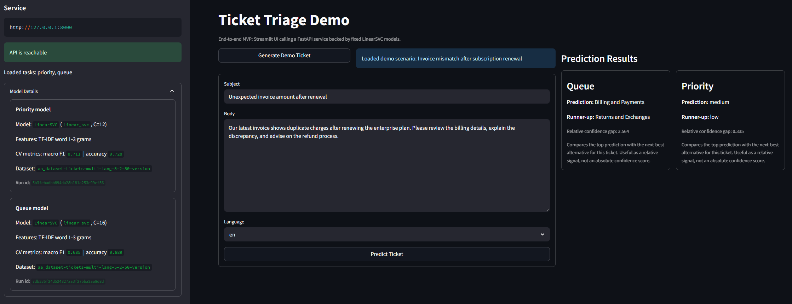

# Ticket Priority ML Service

An end-to-end applied machine learning project for support-ticket triage. The system predicts both the operational `queue` and the business `priority` from ticket text, tracks training runs in MLflow, and serves fixed demo models through a FastAPI API plus a Streamlit UI.

Tech stack: Python, scikit-learn, MLflow, FastAPI, Streamlit, Docker, GitHub Actions



## What This Project Does

- trains two text classifiers on multilingual support-ticket data: one for `queue`, one for `priority`
- evaluates both tasks with shared cross-validation and logs metrics plus artifacts to MLflow
- ships fixed serving assets so the public demo stays runnable and stable
- exposes predictions through a FastAPI service and a Streamlit frontend
- includes tests for preprocessing, evaluation, training/tracking smoke paths, and serving behavior

## Results

| Task | Macro F1 (mean +/- std) | Accuracy (mean +/- std) |
| --- | ---: | ---: |
| Queue | 0.6854 +/- 0.0041 | 0.6892 +/- 0.0029 |
| Priority | 0.7108 +/- 0.0081 | 0.7204 +/- 0.0074 |

Language-specific performance is noticeably stronger on English tickets than on German tickets:

- Queue macro F1: English `0.7841`, German `0.5341`
- Priority macro F1: English `0.7951`, German `0.5960`

## Run The Demo

The demo uses the fixed promoted models that are already checked in under [`serving_assets/`](serving_assets/).

### Fastest Path: Docker

If you already have Docker installed, this is the quickest way to run the full demo.

```powershell
git lfs install
git clone https://github.com/feboe/ticket-priority-ml-service.git
cd ticket-priority-ml-service
git lfs pull
docker build -t ticket-triage-demo .
docker run --rm -p 8000:8000 -p 8501:8501 ticket-triage-demo
```

Open:

- Streamlit UI: `http://127.0.0.1:8501`
- FastAPI docs: `http://127.0.0.1:8000/docs`

### Alternative: Run Locally Without Docker

```powershell
git lfs install
git clone https://github.com/feboe/ticket-priority-ml-service.git
cd ticket-priority-ml-service
git lfs pull
python -m venv .venv
.\.venv\Scripts\Activate.ps1
pip install -r requirements-app.txt
.\.venv\Scripts\python -m nltk.downloader stopwords
```

Start the API:

```powershell
.\.venv\Scripts\uvicorn app.api:app --host 127.0.0.1 --port 8000
```

Start the UI in a second terminal:

```powershell
$env:API_BASE_URL='http://127.0.0.1:8000'
.\.venv\Scripts\streamlit run app/ui.py
```

Open:

- Streamlit UI: [`http://127.0.0.1:8501`](http://127.0.0.1:8501)
- FastAPI docs: [`http://127.0.0.1:8000/docs`](http://127.0.0.1:8000/docs)

## Training And Reproducibility

The public repo is demo-reproducible out of the box because serving uses fixed checked-in model artifacts.

For full retraining, download the public Kaggle dataset [Multilingual Customer Support Tickets](https://www.kaggle.com/datasets/tobiasbueck/multilingual-customer-support-tickets) and place the default training file at:

`data/aa_dataset-tickets-multi-lang-5-2-50-version.csv`

The Kaggle bundle contains multiple CSV files. This repository uses the file above by default, or you can train on a different file with:

```powershell
.\.venv\Scripts\python train.py --data data/<filename>.csv
```

```powershell
pip install -r requirements.txt
.\.venv\Scripts\python train.py --algorithm linear_svc --run-group algo-benchmark-v1
```

To verify the repository locally, run:

```powershell
.\.venv\Scripts\python -m unittest discover -s tests -v
```

Mean cross-validation confusion matrices for the promoted models are available in [queue-confusion-matrix.png](docs/queue-confusion-matrix.png) and [priority-confusion-matrix.png](docs/priority-confusion-matrix.png).

The promoted serving models, their task-specific hyperparameters, and their headline metrics are summarized in [`serving_assets/promoted_models.json`](serving_assets/promoted_models.json). The demo intentionally does not serve "latest run wins" artifacts.

## Limitations

- English performance is substantially better than German performance.
- The system uses TF-IDF features and linear classifiers, so semantic understanding is limited compared with transformer-based approaches.
- Some queue classes remain systematically confusable where business meanings overlap.
- The public repo does not include the full training CSV or the local MLflow history.

## License And Data

- Source code license: MIT, see [LICENSE](LICENSE)
- Upstream dataset license: `CC BY-NC 4.0`
- Derived dataset/model reuse should be reviewed against the upstream dataset terms
