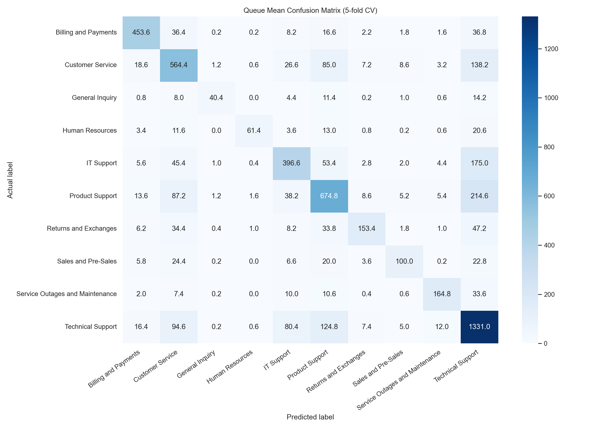
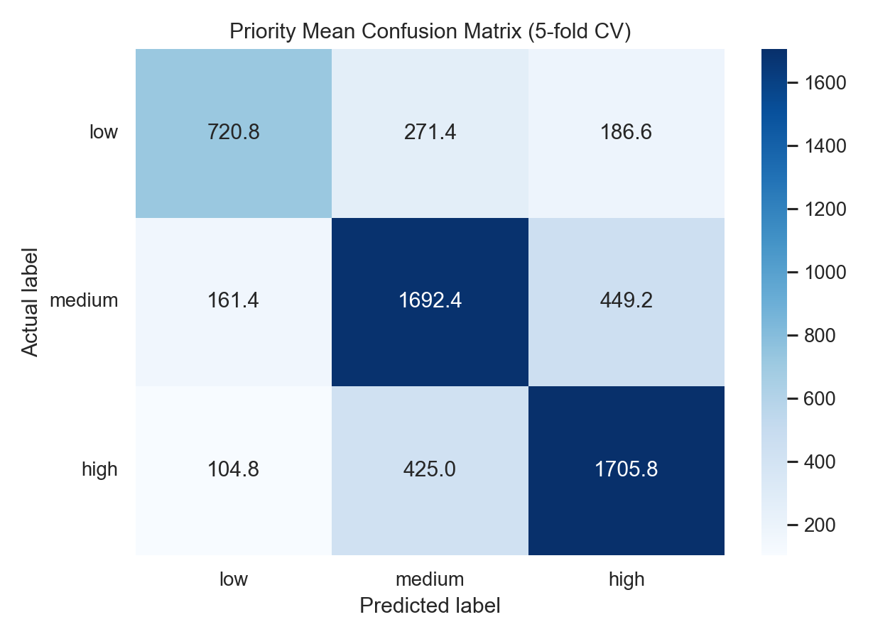

# Ticket Priority ML Service

This repository is an end-to-end applied machine learning project for support-ticket triage. It trains classical text classifiers that predict both the operational `queue` and business `priority`, tracks experiments in MLflow, ships fixed demo serving assets, and exposes the promoted models through a FastAPI service, a Streamlit demo UI, and Docker packaging.

## What This Repository Demonstrates

- bilingual ticket preprocessing for English and German support data
- shared cross-validation and experiment tracking for dual-output classification
- fixed serving assets for a runnable demo plus a separate training workflow for experimentation
- FastAPI inference serving with a Streamlit front end for manual inspection
- Docker packaging for a self-contained MVP

## Quick Start

For the fastest local demo path:

1. Clone the repository with Git LFS enabled.
2. Create and activate a virtual environment.
3. Install `requirements-app.txt`.
4. Download the NLTK stopword corpus.
5. Start FastAPI, then start Streamlit.
6. Open `http://127.0.0.1:8501` for the UI or `http://127.0.0.1:8000/docs` for the API docs.

Detailed setup, testing, and training notes are below.

## Problem Statement / Use Case

Support teams often need to decide two things immediately after a ticket arrives:

1. Which operational queue should handle it
2. How urgent is it

This project automates both decisions from free-text ticket content so that routing and prioritization can happen consistently and quickly.

## Dataset

The default training entrypoint in [train.py](train.py) reads:

- `data/aa_dataset-tickets-multi-lang-5-2-50-version.csv`

Source:

- based on the Kaggle dataset *Multilingual Customer Support Tickets* by Tobias Bueck: <https://www.kaggle.com/datasets/tobiasbueck/multilingual-customer-support-tickets>
- dataset license: `CC BY-NC 4.0`

## Model Provenance / License Scope

- The source code in this repository is released under the MIT License in [LICENSE](LICENSE).
- The referenced training dataset is sourced from Kaggle and listed there as `CC BY-NC 4.0`.
- The checked-in assets under [`serving_assets/`](serving_assets/) are kept as demo artifacts so the repository stays runnable as a portfolio project.
- Reuse of the dataset or derived serving artifacts should be reviewed against the upstream dataset terms; they are not relicensed under the repository's MIT license.

Input fields used by the model:

- `subject`
- `body`
- optional `language` metadata during preprocessing and serving

Target variables:

- `queue`
- `priority`

Queue labels in the shipped model:

- `Billing and Payments`
- `Customer Service`
- `General Inquiry`
- `Human Resources`
- `IT Support`
- `Product Support`
- `Returns and Exchanges`
- `Sales and Pre-Sales`
- `Service Outages and Maintenance`
- `Technical Support`

Priority labels:

- `low`
- `medium`
- `high`

Data leakage avoidance:

- Only ticket text (`subject` + `body`) and optional `language` metadata are used as model inputs.
- Target columns are used for supervision and for shared stratified fold construction, but they are not included as features.
- Cross-validation folds are stratified jointly on `queue` and `priority` via [`src/training_utils.py`](src/training_utils.py) to keep label combinations stable across folds.

## Modeling Approach

### Preprocessing

The preprocessing pipeline is implemented in [`src/preprocessing.py`](src/preprocessing.py):

- concatenate `subject` and `body`
- normalize Unicode with `NFKC`
- lowercase text
- replace URLs, email addresses, and numbers with placeholders
- remove punctuation / collapse whitespace
- apply language-aware stop-word removal for English and German when NLTK stopword data is available

At inference time, the API accepts optional `language` metadata. If it is provided (`en` / `de`), preprocessing can stay consistent with multilingual training. If it is omitted, the service falls back to a generic path without language-specific stop-word filtering.

### Feature Extraction

The current promoted model uses:

- word-level TF-IDF
- `ngram_range=(1, 3)`
- `min_df=1`
- `max_df=0.95`
- no explicit `max_features`
- no additional handcrafted length feature in the shipped model

The final promoted feature space contains `792,218` TF-IDF features for each task, as recorded in:

- [`serving_assets/configs/queue_run_config.json`](serving_assets/configs/queue_run_config.json)
- [`serving_assets/configs/priority_run_config.json`](serving_assets/configs/priority_run_config.json)

### Models

The training code in [`src/classification.py`](src/classification.py) supports:

- Logistic Regression
- Linear SVC

The currently promoted serving models are task-specific `LinearSVC` classifiers with:

- queue: `C=16`
- priority: `C=12`
- `class_weight="balanced"`
- `max_iter=5000`

### Experiment Tracking

Training runs are logged to MLflow from [`train.py`](train.py), including:

- overall cross-validation metrics
- per-class metrics
- confusion-matrix summaries
- run configuration JSON
- final serialized model artifact

The published demo does not serve "latest run wins" artifacts. FastAPI and Streamlit load the fixed checked-in assets under [`serving_assets/`](serving_assets/), while training produces candidate MLflow artifacts for comparison and review.

### Selected Experiments

The full MLflow store contains more runs than should go into the README. The following five experiments capture the main modeling decisions in this repository:

| Experiment | Main change | Queue Macro F1 | Queue Accuracy | Priority Macro F1 | Priority Accuracy | TF-IDF features / task | Outcome |
| --- | --- | ---: | ---: | ---: | ---: | ---: | --- |
| `logreg_baseline` | Logistic Regression with word TF-IDF `(1, 2)` | 0.5666 | 0.5570 | 0.6345 | 0.6439 | 273,792 | Initial baseline |
| `linearsvc_baseline` | Swap in `LinearSVC` on the same `(1, 2)` feature space | 0.6662 | 0.6650 | 0.6858 | 0.6957 | 273,792 | Clear gain over Logistic Regression |
| `linearsvc_1to4_Cq8p4` | Expand to word TF-IDF `(1, 4)` and tune task-specific `C` | 0.6810 | 0.6862 | 0.7098 | 0.7202 | 1,481,556 | Strong metrics, but feature space becomes very large |
| `linearsvc_1to3_Cq16p12` | Reduce to `(1, 3)` while retuning `C` (`queue=16`, `priority=12`) | 0.6854 | 0.6892 | 0.7108 | 0.7204 | 792,218 | Final promoted model |
| `linearsvc_1to3_Cq16p12_nostopge` | Remove German stop-word filtering | 0.6734 | 0.6776 | 0.6986 | 0.7099 | 825,933 | Rejected: lower quality and larger vocabulary |

This sequence is why the shipped model is `linearsvc_1to3_Cq16p12`: it preserves the best quality/complexity trade-off among the experiments that materially changed the system.

## Results

### Overall Cross-Validation Metrics

The deployed model pair is the promoted `linearsvc_1to3_Cq16p12` configuration referenced by the serving assets in [`serving_assets/`](serving_assets/).

These are the 5-fold cross-validation results for the shipped queue and priority models:

| Task | Experiment | Macro F1 (mean +/- std) | Accuracy (mean +/- std) |
| --- | --- | ---: | ---: |
| Queue | `linearsvc_1to3_Cq16p12` | 0.6854 +/- 0.0041 | 0.6892 +/- 0.0029 |
| Priority | `linearsvc_1to3_Cq16p12` | 0.7108 +/- 0.0081 | 0.7204 +/- 0.0074 |

### Language-Specific Performance

Language-specific results:

| Task | Language | Macro F1 (mean +/- std) | Accuracy (mean +/- std) |
| --- | --- | ---: | ---: |
| Queue | English | 0.7841 +/- 0.0106 | 0.7777 +/- 0.0059 |
| Queue | German | 0.5341 +/- 0.0199 | 0.5712 +/- 0.0094 |
| Priority | English | 0.7951 +/- 0.0074 | 0.8006 +/- 0.0073 |
| Priority | German | 0.5960 +/- 0.0109 | 0.6134 +/- 0.0082 |

Interpretation:

- Performance is noticeably better on English tickets than on German tickets.
- The gap is large enough that it should not be treated as cross-validation noise.
- In this project, the class mix is broadly similar across languages, so the gap is more likely related to representation limits of word-based TF-IDF on German morphology and compound words than to simple label imbalance alone.

## Visualizations

The following confusion matrices are generated from the mean 5-fold confusion-matrix artifacts of the shipped MLflow runs.

### Queue Mean Confusion Matrix



Observed pattern:

- `Technical Support`, `Product Support`, and `Customer Service` overlap the most.
- Several queue labels appear semantically adjacent, which is visible in cross-confusions rather than isolated failures.

### Priority Mean Confusion Matrix



Observed pattern:

- The strongest confusion is between `high` and `medium`.
- `low` also overlaps with `medium`, but less strongly than the `high` / `medium` boundary.

## System Overview / Architecture

Inference flow:

```text
Ticket Request
  -> text preprocessing
  -> TF-IDF vectorization
  -> queue LinearSVC
  -> priority LinearSVC
  -> JSON response with labels, runner-up labels, and margin gaps
```

Serving design:

- one fixed `queue` model
- one fixed `priority` model
- FastAPI loads both models once at startup
- Streamlit calls the API rather than loading models directly

## Repository Structure

Tracked project structure:

```text
.
|-- .github/
|   `-- workflows/
|       `-- ci.yml
|-- app/
|   |-- api.py
|   |-- demo_tickets.py
|   |-- service.py
|   `-- ui.py
|-- docs_assets/
|   |-- priority_confusion_matrix.png
|   `-- queue_confusion_matrix.png
|-- serving_assets/
|   |-- configs/
|   |-- models/
|   `-- serving_config.json
|-- src/
|   |-- classification.py
|   |-- evaluation.py
|   |-- preprocessing.py
|   |-- tracking.py
|   `-- training_utils.py
|-- tests/
|   |-- helpers.py
|   |-- test_demo_app.py
|   |-- test_evaluation.py
|   |-- test_preprocessing.py
|   `-- test_training_tracking.py
|-- tools/
|   `-- prepare_serving_assets.py
|-- .dockerignore
|-- .gitattributes
|-- .gitignore
|-- Dockerfile
|-- LICENSE
|-- requirements-app.txt
|-- requirements.txt
|-- start.sh
`-- train.py
```

Local development also uses `data/`, `mlruns/`, and `notebooks/`, but those are local-only resources and are not part of the published repo.

## Setup & Installation

### 1. Clone with Git LFS

The serving models are versioned with Git LFS.

```powershell
git lfs install
git clone <your-repo-url>
cd ticket-priority-ml-service
git lfs pull
```

### 2. Create a virtual environment

```powershell
python -m venv .venv
.\.venv\Scripts\Activate.ps1
```

### 3. Install dependencies

For the full training / development environment:

```powershell
pip install -r requirements.txt
```

For a lighter serving / demo environment:

```powershell
pip install -r requirements-app.txt
```

### 4. Download NLTK stopwords

```powershell
.\.venv\Scripts\python -m nltk.downloader stopwords
```

The app now fails gracefully if the corpus is missing, but the download is still required to enable English/German stop-word filtering.

## Testing

With the complete development environment from [`requirements.txt`](requirements.txt), run:

```powershell
python -m unittest discover -s tests -v
```

GitHub Actions uses the same full test command and installs the full development dependencies, including `mlflow`, so the public CI run exercises the training and tracking smoke path as well.

## Run Locally

The demo application serves the fixed promoted models from [`serving_assets/`](serving_assets/).

Start the FastAPI service:

```powershell
.\.venv\Scripts\uvicorn app.api:app --host 127.0.0.1 --port 8000
```

In a second terminal, start Streamlit:

```powershell
$env:API_BASE_URL='http://127.0.0.1:8000'
.\.venv\Scripts\streamlit run app/ui.py
```

Endpoints:

- Streamlit UI: `http://127.0.0.1:8501`
- FastAPI docs: `http://127.0.0.1:8000/docs`
- Health check: `http://127.0.0.1:8000/health`

### Training

Run a full training pass to create MLflow-tracked candidate models and metrics:

```powershell
.\.venv\Scripts\python train.py --algorithm linear_svc --run-group algo-benchmark-v1
.\.venv\Scripts\python -m mlflow ui --backend-store-uri .\mlruns
```

Running `train.py` does not update the demo automatically. Promoting selected MLflow artifacts into [`serving_assets/`](serving_assets/) is a maintainer-only release step handled separately.

## Run with Docker

Build and start the single-container MVP:

```powershell
docker build -t ticket-triage-demo .
docker run --rm -p 8000:8000 -p 8501:8501 ticket-triage-demo
```

The container installs `requirements-app.txt`, downloads the NLTK stopword corpus, starts FastAPI on port `8000`, and starts Streamlit on port `8501`.

## API Usage

### Request

`POST /predict`

```json
{
  "subject": "Critical security incident affecting the account portal",
  "body": "Multiple users report that the account portal is unavailable after suspicious login activity. We need urgent investigation, containment guidance, and an update on service restoration steps.",
  "language": "en"
}
```

### Response

The following example was produced from the current shipped models:

```json
{
  "input": {
    "subject": "Critical security incident affecting the account portal",
    "body": "Multiple users report that the account portal is unavailable after suspicious login activity. We need urgent investigation, containment guidance, and an update on service restoration steps.",
    "language": "en"
  },
  "predictions": {
    "priority": {
      "label": "high",
      "runner_up_label": "medium",
      "margin_gap": 0.737713
    },
    "queue": {
      "label": "Technical Support",
      "runner_up_label": "Service Outages and Maintenance",
      "margin_gap": 0.540114
    }
  },
  "models": {
    "priority": {
      "run_id": "5b3febadbb894da28b181a253e99ef56",
      "algorithm": "linear_svc",
      "model_family": "LinearSVC",
      "feature_families": [
        "tfidf"
      ]
    },
    "queue": {
      "run_id": "7db335f24d524827aa3f27bba2aa8d8d",
      "algorithm": "linear_svc",
      "model_family": "LinearSVC",
      "feature_families": [
        "tfidf"
      ]
    }
  }
}
```

## Streamlit UI

The UI in [`app/ui.py`](app/ui.py) provides a lightweight front end for manual inspection:

- manual ticket entry for `subject` and `body`
- optional `language` selector (`en` / `de`)
- curated demo tickets for both English and German
- side-panel model metadata
- prediction display for both `queue` and `priority`, including runner-up labels and decision-margin gaps

## Limitations

- English performance is substantially better than German performance.
- The system relies on TF-IDF features and linear classifiers, so it has limited semantic understanding compared with transformer-based approaches.
- Queue labels with overlapping business meaning still produce systematic confusions.
- Ticket labels may contain some unavoidable ambiguity or noise, especially where support categories are semantically close.
- The project does not currently use transformer models, multilingual sentence encoders, or LLM-based reranking.

## Future Work

- Evaluate multilingual transformer models for both queue and priority prediction
- Improve German handling beyond word-level TF-IDF
- Add confidence- or abstention-based routing for uncertain tickets
- Extend error analysis with per-language, per-class diagnostics
- Compare calibrated linear models against stronger multilingual baselines

## Tech Stack

- Python
- pandas
- scikit-learn
- SciPy
- NLTK
- MLflow
- FastAPI
- Streamlit
- Uvicorn
- Docker
