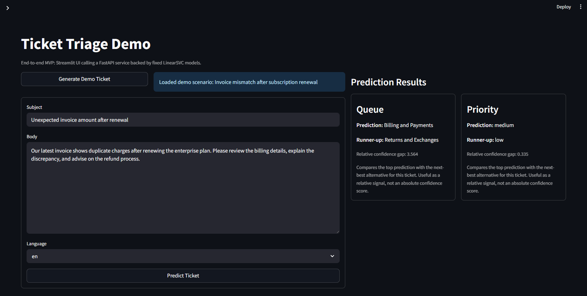

# Ticket Priority ML Service

An end-to-end applied machine learning project for support-ticket triage. The system predicts both the operational `queue` and the business `priority` from ticket text, tracks training runs in MLflow, and serves fixed demo models through a FastAPI API plus a Streamlit UI.

Tech stack: Python, scikit-learn, MLflow, FastAPI, Streamlit, Docker, GitHub Actions



## What This Project Does

- trains two text classifiers on multilingual support-ticket data: one for `queue`, one for `priority`
- evaluates both tasks with shared cross-validation and logs metrics plus artifacts to MLflow
- ships fixed serving assets so the public demo stays runnable and stable
- exposes predictions through a FastAPI service and a Streamlit frontend
- includes tests for preprocessing, evaluation, training/tracking smoke paths, and serving behavior

## Results

### Selection Cross-Validation

| Task | Macro F1 (mean +/- std) | Accuracy (mean +/- std) |
| --- | ---: | ---: |
| Queue | 0.6854 +/- 0.0041 | 0.6892 +/- 0.0029 |
| Priority | 0.7108 +/- 0.0081 | 0.7204 +/- 0.0074 |

Language-specific performance is noticeably stronger on English tickets than on German tickets:

- Queue macro F1: English `0.7841`, German `0.5341`
- Priority macro F1: English `0.7951`, German `0.5960`

### Frozen Holdout

| Task | Macro F1 | Accuracy |
| --- | ---: | ---: |
| Queue | 0.2470 | 0.3006 |
| Priority | 0.4314 | 0.4712 |

The separate synthetic holdout shows a substantial transfer gap, especially
for queue routing. These final holdout results are reported separately from the
cross-validation results used for model selection. See
[`docs/experiments.md`](docs/experiments.md) for language slices and detailed
interpretation.

## Run The Demo

The demo uses the fixed promoted models that are already checked in under [`serving_assets/`](serving_assets/).

### Fastest Path: Docker

If you already have Docker installed, this is the quickest way to run the full demo.

```bash
git lfs install
git clone https://github.com/feboe/ticket-priority-ml-service.git
cd ticket-priority-ml-service
git lfs pull
docker build -t ticket-triage-demo .
docker run --rm -p 8000:8000 -p 8501:8501 ticket-triage-demo
```

Open:

- Streamlit UI: `http://127.0.0.1:8501`
- FastAPI docs: `http://127.0.0.1:8000/docs`

### Alternative: Run Locally Without Docker

```bash
git lfs install
git clone https://github.com/feboe/ticket-priority-ml-service.git
cd ticket-priority-ml-service
git lfs pull
python3 -m venv .venv
source .venv/bin/activate
python -m pip install -r requirements-app.txt
python -m nltk.downloader stopwords
```

Start the API:

```bash
python -m uvicorn app.api:app --host 127.0.0.1 --port 8000
```

Start the UI in a second terminal:

```bash
source .venv/bin/activate
export API_BASE_URL='http://127.0.0.1:8000'
python -m streamlit run app/ui.py
```

Open:

- Streamlit UI: [`http://127.0.0.1:8501`](http://127.0.0.1:8501)
- FastAPI docs: [`http://127.0.0.1:8000/docs`](http://127.0.0.1:8000/docs)

## Training And Reproducibility

The demo uses fixed checked-in model artifacts. For full retraining, download
the public Kaggle dataset [Multilingual Customer Support Tickets](https://www.kaggle.com/datasets/tobiasbueck/multilingual-customer-support-tickets)
and place the training CSV at
`data/aa_dataset-tickets-multi-lang-5-2-50-version.csv`.

### Train

```bash
python -m pip install -r requirements.txt
python -m nltk.downloader stopwords
python -m scripts.train --algorithm linear_svc --run-group algo-benchmark-v1
```

Pass `--data data/<filename>.csv` to train on another file from the bundle.

### Evaluate The Frozen Holdout

```bash
python -m scripts.evaluate_holdout
```

This verifies the dataset hash and records one MLflow run per task in the
`ticket-priority-holdout` experiment. Local result copies are written to the
Git-ignored `results/holdout/` directory.

### Test

```bash
python -m unittest discover -s tests -v
```

Dataset identity and the holdout protocol are documented in
[docs/datasets.md](docs/datasets.md). Model selection and detailed results are
documented in [docs/experiments.md](docs/experiments.md), while the promoted
serving metadata is stored in
[`serving_assets/promoted_models.json`](serving_assets/promoted_models.json).

## Limitations

- Performance drops substantially on the separate synthetic holdout, especially for queue routing, indicating limited transfer beyond the model-selection dataset.
- English performance is substantially better than German performance.
- The system uses TF-IDF features and linear classifiers, so semantic understanding is limited compared with transformer-based approaches.
- Some queue classes remain systematically confusable where business meanings overlap.
- The public repo does not include the full training CSV

## License And Data

- Source code license: MIT, see [LICENSE](LICENSE)
- Upstream dataset license: `CC BY-NC 4.0`
- Derived dataset/model reuse should be reviewed against the upstream dataset terms
