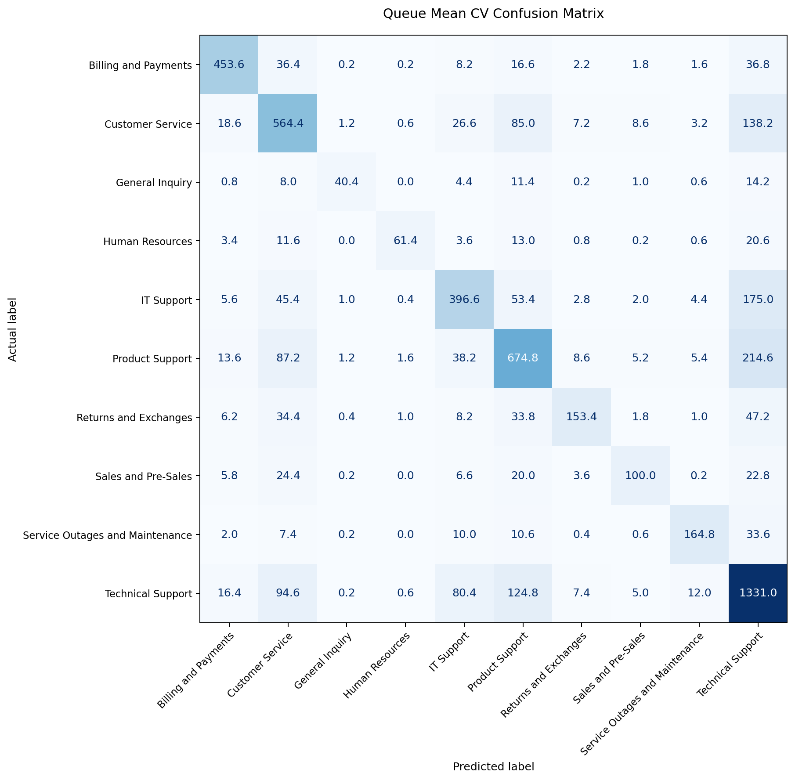
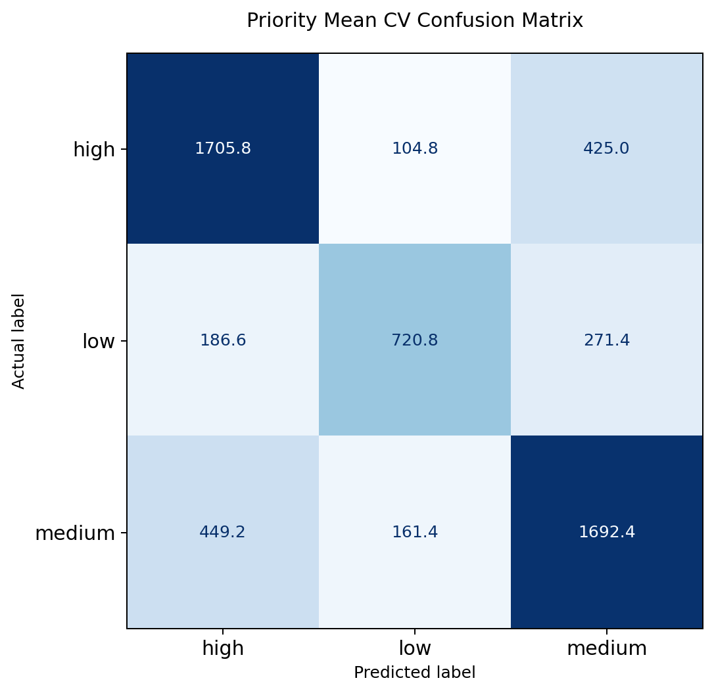

# Experiments

## Overview

This project trains two text classifiers for multilingual support-ticket triage:

- `queue` prediction for routing tickets to the right support team
- `priority` prediction for estimating business urgency

All candidates were tracked in MLflow and evaluated on `28,587` synthetic tickets with `5`-fold stratified cross-validation.

## Metric Choice

- `queue` is strongly imbalanced looking at the following subset: `Technical Support 8362`, `Product Support 5252`, `Customer Service 4268`, `General Inquiry 405`, `Human Resources 576`.
- `priority` is only mildly imbalanced: `medium 11515`, `high 11178`, `low 5894`.
- Macro F1 is therefore the main ranking metric, especially for `queue`, while accuracy stays visible as the companion metric for every run.

## Experiment Comparison

### Queue Experiments

| Step | Model | N-grams | C | TF-IDF cols | Stop words | Macro F1 | Accuracy | Interpretation |
| --- | --- | --- | ---: | ---: | --- | ---: | ---: | --- |
| 1 | LogisticRegression | 1-2 word | 2 | 273,792 | on | 0.5666 | 0.5570 | weak baseline |
| 2 | `LinearSVC` | 1-2 word | 2 | 273,792 | on | 0.6662 | 0.6650 | classifier swap helps |
| 3 | LinearSVC | `1-4 word` | 2 | `1,481,556` | on | 0.6787 | 0.6807 | better, but large space |
| 4 | LinearSVC | `1-3 word` | `16` | `792,218` | on | **0.6854** | **0.6892** | best overall after C sweep; promoted |
| 5 | LinearSVC | 1-3 word | 16 | `772,964` | `off` | 0.6779 | 0.6792 | worse without stop-word removal |

### Priority Experiments

| Step | Model | N-grams | C | TF-IDF cols | Stop words | Macro F1 | Accuracy | Interpretation |
| --- | --- | --- | ---: | ---: | --- | ---: | ---: | --- |
| 1 | LogisticRegression | 1-2 word | 2 | 273,792 | on | 0.6345 | 0.6439 | weak baseline |
| 2 | `LinearSVC` | 1-2 word | 2 | 273,792 | on | 0.6858 | 0.6957 | classifier swap helps |
| 3 | LinearSVC | `1-4 word` | 2 | `1,481,556` | on | 0.7061 | 0.7164 | better, but large space |
| 4 | LinearSVC | `1-3 word` | `12` | `792,218` | on | **0.7108** | **0.7204** | best overall after C sweep; promoted |
| 5 | LinearSVC | 1-3 word | 12 | `772,964` | `off` | 0.6996 | 0.7105 | worse without stop-word removal |

Both tables use the same five-step progression. These steps summarize the most informative experiments from the model selection process. Models were promoted based on macro F1 first, with accuracy as a secondary check. When performance was close, the smaller feature space was preferred over the larger alternative for simplicity and deployment efficiency.

## Confusion Matrices For The Promoted Models

### Queue

The queue matrix shows the heaviest overlap among `Technical Support`, `Product Support`, and `Customer Service`. Recall is also weaker for `General Inquiry` and `Human Resources`, where the classes are smaller and the phrasing is less distinctive.

### Priority

The priority matrix is cleaner overall, but the dominant errors are still between adjacent business levels. The largest confusion is `high` predicted as `medium`, with `low` also drifting into `medium`.

## Language Performance

Language-specific evaluation on the promoted models shows a clear English-German gap:

- Queue macro F1: English `0.7841`, German `0.5341`
- Priority macro F1: English `0.7951`, German `0.5960`

## Takeaways

- `LinearSVC` consistently outperformed `LogisticRegression` on both tasks.
- The tuned `1-3` word-ngram setup beat the larger `1-4` feature space on both tasks and was promoted.
- Disabling stop-word removal hurt both tasks, so the default language-aware preprocessing stayed in place.

## Notes

The dataset is synthetic and intended to demonstrate a reproducible ticket-triage workflow rather than benchmark performance on real production traffic.
